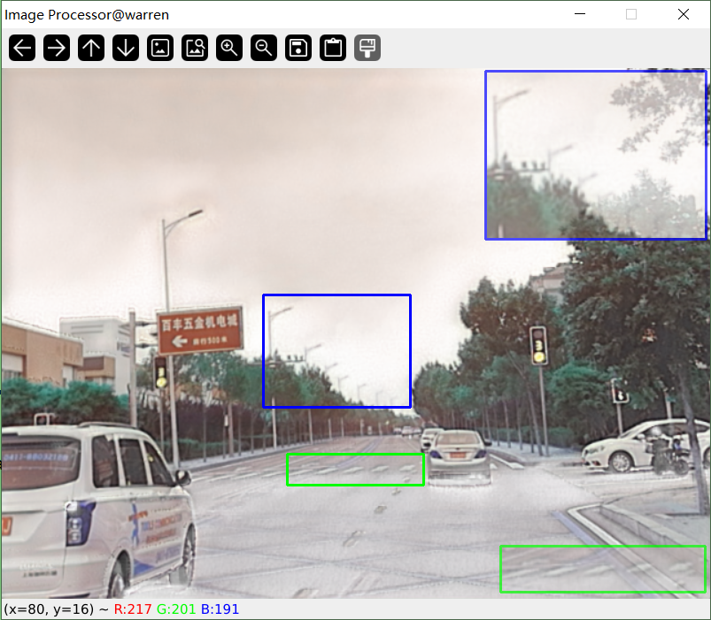

## 资源监视器
### ZoomMarker
python
### 项目简介
主要用于制作缩放对比图

### 安装说明
```bash
pip install -r requirments.txt 
```
### 使用说明


### TODO


## 关于作者
* warren@伟
* 个人博客：其他内容可以参考我的博客[CSDN-warren@伟](https://blog.csdn.net/warren103098?type=blog)

